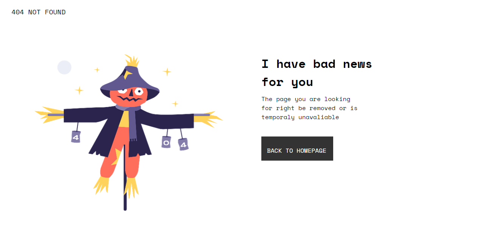
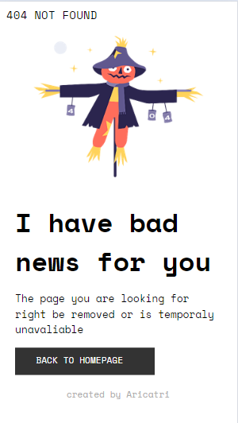

# Make It Real - Página 404 Not found

Solucion a la tarea  de replicar la pagina 404

## Tabla de Contenidos

- [Make It Real - Página 404 Not found](#make-it-real---página-404-not-found)
  - [Tabla de Contenidos](#tabla-de-contenidos)
  - [Resumen](#resumen)
    - [El desafío](#el-desafío)
    - [Pantallazo](#pantallazo)
  - [Mi proceso](#mi-proceso)
    - [Tecnología utilizada](#tecnología-utilizada)
    - [Lo que aprendí](#lo-que-aprendí)
    - [Desarrollo a futuro](#desarrollo-a-futuro)
    - [Recursos útiles](#recursos-útiles)
  - [Autor](#autor)
  - [Agradecimientos](#agradecimientos)

## Resumen
Verificamos  la estructura de la pagina tanto mobile como desktop de manera responsive 1440px y 375px
### El desafío

 Se debe de poden entrar a la pagina de 404 Error y verificarlo de manera responsive

### Pantallazo

Se muestra el pantallazo del modo escritorio y mobile, ee utilizó el archivo CSS con variables de colores :root como base para definir los colores del diseño. Esta metodología permite una fácil gestión y modificación de los colores a lo largo del desarrollo del estilo.

## Mi proceso

### Tecnología utilizada

- HTML
- CSS

### Lo que aprendí

Repase la estructura del html , los passo escenciales del header, footer and body y trabaje con css para el diseño y la adaptación de manera   responsable siguiendo las medidas de los dispositivos.

### Desarrollo a futuro

Trabajare en mas detalles de la pagina , tratare de reducir codigo ya que soy conciente que repito muchos pasos
### Recursos útiles

GeeksforGeeks
MDN Web Docs
Linkedln Learning
## Autor

- Github - [@Aricatri](https://github.com/Aricatri)

## Agradecimientos

Agradesco a las plataformas en linea por los recursos de aprendizaje con una interfaz facil de conseguir
